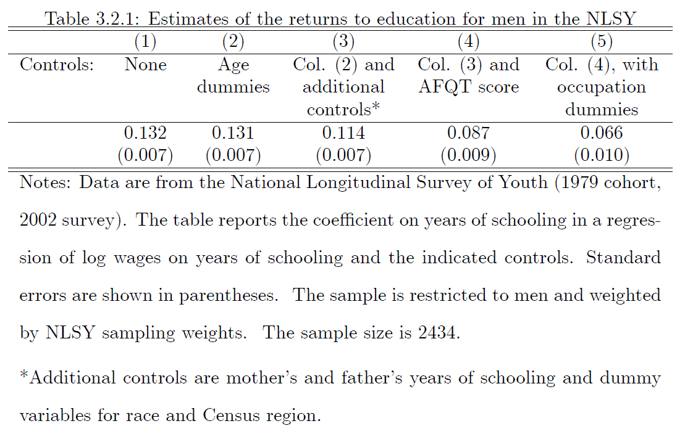

```{r setup, include=FALSE}
knitr::opts_chunk$set(echo = TRUE)
```

********************************************************************************


# **[50 Points]** Final Grade Calculator
********************************************************************************


This section will teach you how to estimate your final grade based upon
assignment performance and potential extra credit.

## **[10 Points]** Markdown Tables
********************************************************************************

Recreate the assignment breakdown table from the syllabus (the second table on page 3). 

*Note: You can neither add a top or bottom line in the Markdown table nor adjust line thickness.*

--Your Table Here--


## **[40 Points]** Final Grade Calculation
********************************************************************************

All estimating your final grade requires is calculating a weighted average.

$$ \text{Final Grade} = \frac{1}{\sum_{a=1}^n \text{weight}_a}\sum_{a = 1}^n \text{weight}_a \text{grade}_a + \text{extra credit}$$
where $a$ stands for the assignments. 


**[5 Points]** Create one object per $\text{weight}_a$, and define percents as shares. 
For example: $90% = 0.9$.

*Hint: write out the math by hand first for each question in this section. The extra credit makes the math non-trivial.*


```{r creating weights}

```


Suppose you get the following df_grades on your assignments:

- HW0: 100/100
- HW1: 39/46
- HW2: 73/80
- HW3: 16743/18110
- HW4: 9/11
- Exam 1: 18/23
- Exam 2: 2/2
- Extra credit: 2%

**[5 Points]** Create an object for each assignment.


```{r final grade calculation}

```

**[4 points]** Print your hypothetical final grade

```{r final grade}

```

Suppose it is near the end of the semester, and the only assignment we haven't done is Exam 2 but you still have the same amount of extra credit. 


**[4 Points]** What percentage of **all points possible** have you received so far?

```{r so far all}

```


**[4 Points]** What percentage of points **currently available** have you received so far (i.e. excluding the Exam 2)?

```{r so far}

```

**[8 Points]** Is it possible to bump you grade to the next letter (e.g. C to C+)?
Regardless of your answer, what is the **minimum score** you need on Exam 2 to achieve the next letter grade?
Verify that this score perfectly bumps you to the next letter grade.

```{r bump grade}

```


# **[10 Points]** $\LaTeX$ Math
********************************************************************************

Reproduce the math and text in the file `elasticities.pdf`. 
You will need to use the `align` $\LaTeX$ environment and the Greek letter $\Delta$.

--your answer here--


# **[40 Points]** Ordinary Least Squares
********************************************************************************

Estimating the effect of education on wages is particularly challenging because of omitted variable bias (OVB).
We typically think that

$$\text{wage} = f(\text{education}, \text{experience}, \text{background}, \text{genetics}, \text{ability})$$

We are going to illustrate an example of OVB by replicating the values from table 3.2.1 from Mostly Harmless Economics (MHE) (as best we can, i.e. the numbers won't match) using data [National Survey of Youth](https://www.nlsinfo.org/investigator/pages/login).




## **[15 Points]** Cleaning the NLSY Data
********************************************************************************

We are ultimately interested in estimating the regression:

$$log(wage_i) = \alpha + \delta yos_i + \beta_m Myos_i + \beta_f Fyos_i + \beta_a AFQT_i + \gamma_{age} + \gamma_{race} + \gamma_{region} + \gamma_{occ} + \epsilon_i $$
where $yos_i$ is years of schooling, $Myos_i$ and $Fyos_i$ are mother's and father's years of schooling respectively, $AFQT_i$ is the Armed Forces Qualification Test (0 - 100,000), and the $\gamma$ variables represent dummy variables.


Before we can work with the data, we need to clean it. 

1. **[2 points]** Load in the packages `tidtyverse` and `fixest`
2. **[1 point]** Load in the data as `nlsy` using `read_csv()`
3. **[12 points]** In one line, create the object `df` from `nlsy` by
    - `filter()`ing the data to  
        - be males (`SAMPLE_SEX_1979`) 
        - with positive wages (`Q13-5_TRUNC_2002`)
    - `mutate()` the variables:
        - `mother_yos`, `father_yos`, and `yos` from the variables that contain `HGC` (highest grade completed) appropriately using `case_when()`
            - Hint 1: in a separate line of code, use `unique(c(..., ..., ...))` to determine the values in the variables that need to be mapped to the numerical years of schooling. Duplicates exist! You may need to use `==` or `%in%`
            - Hint 2: to save time copy and paste the "empty" `case_when()` formulas that look like `variable_name == "" ~ `.
            - Hint 3: once you have completed `mother_yos`, open a new script and use find-and-replace (Ctrl-F) feature to quickly create `father_yos` and `yos`
        - `afqt` to be the percent (e.g. 91.234) of `AFQT-3_1981` by using division
        - optionally, create the variable `wage` equal to `Q13-5_TRUNC_2002` to save time while typing code
    - chain `na.omit()` to remove missing observations


```{r cleaning}

```

## **[5 Points]** Regressions
********************************************************************************

Create five objects named `fit1`, `fit2`, ..., `fit5` that correspond to the five columns in MHE Table 3.2.1 using the function `feols()` and the `weights` argument of `feols()` with heteroskedastic robust standard errors.
"Dummies" refer to fixed effects.

Note: your coefficients will not match the table from the book.
You may need to use the function `names()` on `df` to obtain the remaining variables.
Points are awarded for correct code, not output (you do not need to print the regressions).


*Hint: the coefficient on* `yos` *in the fourth regression should be 0.0996...*.

```{r regrssions}


```

## **[5 Points]** Frisch-Waugh-Lovell Plot
********************************************************************************

Using the control variables from the fourth regression

1. run another regression to obtain $\tilde{x}_{yos}$. Create a new variable in `df` using $\tilde{x}_{yos}$
2. using the package `ggplot2`, plot $\tilde{x}_{yos}$ vs `log(wages)` using a scatter plot (`geom_point()`) 
3. with a linear best fit line (`geom_smooth()` with the argument `method` adjusted appropriately) 
4. label the x-axis and label the y-axis
5. provide a title


```{r fwl}

```

## **[20 Points]** Estimate Table
********************************************************************************

Here you are going to use a function that we have not discussed in class so far.
The purpose of this section is guide you through using a new function for the first time.
Specifically, you will be using the function `etable()` from the package `fixest` to neatly report the five regressions from above.
You are going to produce a slightly modified version of Table 3.2.1.
Step-by-step instructions are provided. 


The first thing we are going to is create an object that maps variable names in `df` to the labels we want in the table.

- **[9 points]**  Create the object `tab_dict` using the format `c("variable_name_in_df" = "table_name", ...)` by mapping
    - `"yos" to "Years of Schooling"`
    - `"mother_yos"` to `"Mother's Years of Schooling"`
    - `"father_yos"` to `"Father's Years of Schooling"`
    - `"afqt"` to `"AFQT"`
    - `"AGEATINT_2002"` to `"Age"`
    - `"SAMPLE_RACE_78SCRN"` to `"Race"`
    - `"REGION_2002"` to `"Census Region"`
    - `"OCCALL-EMP.01_2002"` to `"Occupation"`
    - `"log(wage)"` to `"log Wage"`

Now to produce the table.

- **[9 points]** call the function `etable()`
    - set the first five arguments to equal to the regression objects from above
    - set the argument `se.below` to true
    - set the argument `dict` to `tab_dict`
    - set the argument `keep` to `!Constant`
    - set the argument `fitstat` to a formula with an empty left hand side and a right hand side to `n` plus `r2`


```{r etable}

```

**[2 Points]** A bad control is one that is a variable that is a function of (determined by) the treatment variable.
Here the outcome variable is wages and the treatment variable is the individual's years of schooling. 
Which, if any, of the control variables are bad controls?

--your answer here--