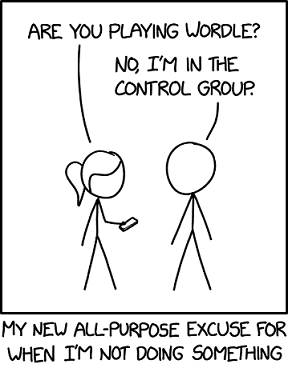
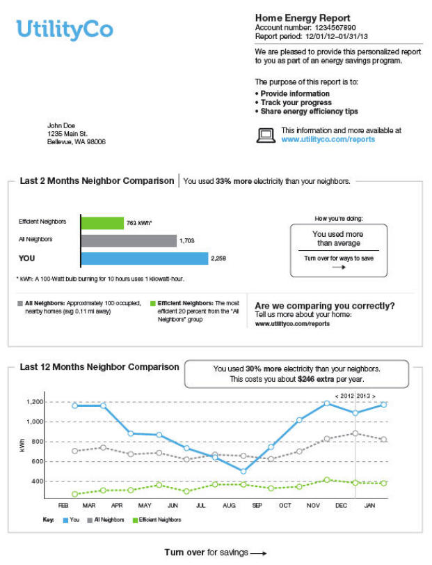

```{r setup, include=FALSE}
knitr::opts_chunk$set(echo = TRUE)
```

<center>

</center>

# **[25 Points]** Thinking Causal
********************************************************************************

This section is based around Alcott (2015) "Site Selection Bias in Program Evaluation."

Opower corporation (acquired by Oracle in 2016) was a software company that provided customer engagement materials for utility companies.
In 2008-2013 Opower conducted an experiment to determine if knowledge about a household's neighbors' energy consumption would reduce energy consumption.
Opower reach out to many utility companies, which which 111 local utility companies responded over the five years, to provide a two-page letter Home Energy Report with a Neighbor Comparison Module via mail.

<center>

</center>

## **[15 Points]** Experimental Research Questions
********************************************************************************

Suppose the United States Department of Energy hires you to evaluate the experiment. 
We are going to go through a list of questions to determine the empirical design and to identify potential issues.

1. **[6 Points]** What is the unit of observation, the outcome variable, and the treatment variable?

--Your answer here--

2. **[2 Points]** What are the potential outcomes?

--Your answer here--

3. **[4 Points]** Looking at the example Home Energy Report image, list at least two causal channels by how the treatment could affect the outcomes.

--Your answer here--

4. **[3 Points]** Provide one possible source of selection bias. Which way would this bias estimated treatment effects and why?

--Your answer here--

## **[10 Points]**Randomization
********************************************************************************

5. **[4 Points]** How would randomization solve the selection bias issue you identified in the previous question?

--Your answer here--

6. **[6 Points]** Provide one example for how internal validity may be violated and one example for how external validity may be violated, even under randomization of treated households at the participating utility companies.

--Your answer here--


# **[60 Points]** Randomized Experiments
********************************************************************************

In this section we are working with data from Bertrand and Mullainathan (2004) "Are Emily and Greg More Employable Than Lakisha and Jamal? A Field Experiment on Labor Market Discrimination."
The researchers sent 4,870 fictitious resumes out to employers in response to job adverts in Boston and Chicago in 2001. 
They varied only the names of job applicants while leaving other relevant candidates’ attributes unchanged (i.e. candidates had similar qualifications).
Some applicants had stereotypically white-sounding names such as Emily Walsh and Greg Baker, whereas other resumes contained stereotypically black-sounding names such as Lakisha Washington or Jamal Jones. 
Hence, any difference in callback rates can solely be attributed to name manipulation.

## **[10 Points]** DAG
********************************************************************************

**[6 Points]** Using a PowerPoint slide either saved as a `.png` or `.jpeg`, create a DAG for resume callbacks.
Let:

- $D=$ treatment: black-sounding name
- $Y=$ outcome: callback

Use and define in writing any other variables or groupings of related variables (e.g. $P=$ performance: {horsepower, torque, handling}) that are relevant to the experiment.
Indicate their effect using arrows.
Furthermore, indicate if they are observable or unobservable effects using either solid- or dashed-line arrows.

*Hint: there are multiple correct answers.*

--Your DAG and answer here--

**[4 Points]** List all of the pathways in the DAG you have created using $\rightarrow$ and $\leftarrow$ between the varaibles. 
Indicate whether a path is **direct**, **mediated**, or a **backdoor**. 
If you DAG has any *collider* variables, list them as well.

--Your answer here--

## **[10 Points]** Potential Outcomes
********************************************************************************

Using the potential outcomes framework, describe the experiment:

1. **[1 Point]** What is the unit of observation $i$?
2. **[1 Point]** What is the treatment $D_i$? 
3. **[1 Point]** What are the outcomes $Y_i^j$? 
4. **[1 Point]** What is the counterfactual? 
5. Simple differences in outcomes
    a. **[2 Points]** Use $\LaTeX$ to write out the SDO decomposition equation in a `align` $\LaTeX$ environment to **ensure none of the equation is cutoff when knitting** this document.
    b. **[2 Points]** Without randomization, do you think the selection bias will be positive or negative?
    c. **[2 Points]** Without randomization, do you think the heterogeneous treatment effects will be positive or negative?


--Your answer here--


## **[5 Points]** Cleaning the Data
********************************************************************************

1. **[1 Point]** Load the `tidyverse` package
2. **[2 Points]** Load in the data as `resume`
3. **[2 Points]** Create a dummy variable for female applications named `female` using the `sex` variable

```{r cleaning}

```


## **[15 Points]** Balance Table
********************************************************************************

1. **[10 Points]** Produce a balance table using the variables education (`education`), years of experience (`years`), military experience (`military`), computer skills (`computerskills`), special skills (`specialskills`), and gender (`female`). 


*Hint:*

- *you need the columns for treated average, control average, difference, and p-value*
- *instead of using* `summarize(across(everything(), fn))`, *replace* `everything()` *with* `c(variable1, variable2, ...)`

```{r}

```

2. **[5 Points]** Which of the variables (if any) are statistical different at the 95% confidence level? If any of the variables are significantly different, does the treatment group or control group have a higher average value?


--Your answer here--

## **[20 Points]** Treatment Effects
********************************************************************************


### **[5 Points]** t-test
********************************************************************************

1. **[2 Points]** Use `t.test()` to determine if there is a statistically significant racial gap in callbacks. Print the test results.
2. **[1 Point]** According to the group means, what is the treatment effect size from the t-test?
3. **[2 Points]** If there is a gap, which perceived race is more likely to be called back?

```{r t test}

```

--Your answer here--

### **[15 Points]** Regression
********************************************************************************

Using the `fixest` package

1. **[4 Points]** Fit the following regressions with heteroskedastic robust standard errors
    a. $Y$ on $D$
    b. $Y$ on $D$ and $\textbf{X}$, where $\textbf{X}$ are the controls in the balance table
    
```{r regression}

```

2. **[8 Points]** Use `etable()` to produce a table of the two regression results. 
    - Set the standard errors below
    - Remove the standard error type row
    - Use only the number of observation and $R^2$ fit statistics
    - Rename the variables appropriately
    
    
```{r etable}

```

3. **[3 Points]** Compare the results from the t-test and the two regressions. Are effect estimates statistically different from each other at the 95% confidence level (i.e. is $\hat{\delta_1^1} \lessgtr \hat{\delta_1^2} \pm 1.96se(\hat{\delta_1^1})$)?


--Your answer here--


# **[15 Points]** Experimental Design and A/B Testing
********************************************************************************

Suppose you graduate from UIUC and enter the real world as a data scientist for [insert-airline-company-name-here] incorporated. 
insert-airline incorporated has seatback entertainment touchscreens and runs an advertisement for in-flight purchases while passengers board the plane. 
IACNH inc. has been using the same advertisement for the last decade, so highflier you wants to measure the causal effect of updating the ad.


1. **[2 Points]** List at least two outcomes you could measure.

--Your answer here--

2. **[4 Points]** Describe the specifics of treatment and control group randomized assignment, the hypothesis test for your experiment ($H_0$ and $H_a$), and the unit of observation.

*Hint: be careful with SUTVA violations*.

--Your answer here--


3. **[3 Points]** Suppose you will run a t-test with equal control and treatment group sizes. What is the required sample size for running this experiment with a power of 0.8, significance level of 0.05, and an effect size of 0.5?

*Hint: use the package* `pwr`.

```{r min sample}

```


4. **[2 Points]** How does your required number of observations change if the effect size is 0.1?

```{r min sample small effect}

```


5. **[4 Points]** Suppose you see a statistically significant increase in advertisement clicks, but you do not see any change in purchases. What could explain this outcome?

--Your answer here--


