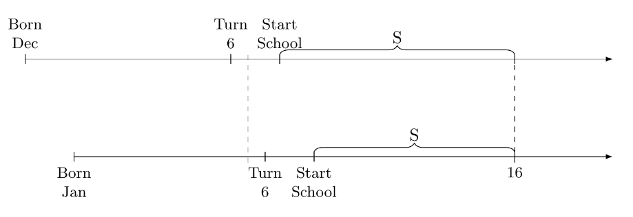
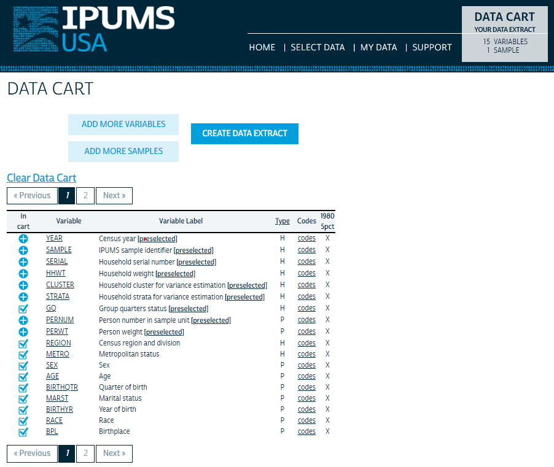

```{r setup, include=FALSE}
knitr::opts_chunk$set(echo = TRUE)
```


This homework assignment is designed as a **guided** replication of the seminal [Angrist and Krueger (1991) "Does Compulsory School Attendance Affect Schooling and Earnings?"](https://www.jstor.org/stable/2937954#metadata_info_tab_contents).
You will go through all of the motions from

1. Thinking about validity and violations of their econometric design
2. Downloading data
3. Cleaning data
4. Reproducing figures
5. Reproducing tables

Because you will be downloading and cleaning the data instead of using the exact dataset used by Angrist and Krueger, you will not be able to replicate the numbers exactly. 
However, the results will be qualitatively similar, and the main takeaways will still hold true.

**CAUTION**: All figure and table replications use a specific subset of the data. **Points will be deducted for incorrect subsets**.

# **[20 Points]** Thinking Econometric
********************************************************************************

Angrist and Krueger (1991) is another example of estimating the returns of schooling on wages (this effect is still studied to this day). 
As you and they know, years of schooling is an endogenous variable.
Running the regression $wages_i = \alpha + \beta YearsOfSchooling_i + \eta_i$ will return a biased estimate.
They overcome this obstacle by instrumenting years of schooling with quarter-of-birth based upon the intuition from the figure below.




The figure demonstrates that compulsory schooling laws create a wedge in the start age of students.
Consider two individuals, one who was born in December (quarter 4) and one who was born in January (quarter 1).
The January-born student will start school a year later than December-born student (the leftmost vertical dashed line), even though they are one month apart in age.
This matters because the legal high school dropout age in America is 16. 
When facing the decision to dropout, the *cost* of completing high school is one year higher for the January-born student making said student have a larger incentive to dropout. 

This intuition from the quarter-of-birth effect on dropout likelihood motivates using the birth quarter as an instrument for schooling attainment. 


## **[5 Points]** Biased OLS Estimates
**********************************************************************

Think back to the IV1 2SLS lecture.
Suppose we want to run the long regression:

$$w_i = \alpha + \delta s_i + \gamma a_i + \epsilon_i \tag{1}$$
but we only have data to estimate the short equation

$$w_i = \alpha + \delta s_i  + \eta_i \tag{2}$$
where $w_i$ is wages, $s_i$ is years of schooling, and $a_i$ is ability. 
Using the omitted variable bias formula, do you think estimating (2) with OLS will have a positive or negative bias. Why?

-- your answer here --


## **[15 Points]** LATE Identification Assumptions
**********************************************************************

All instrumental variable techniques estimate a local average treatment effect. 
Let's take a moment to think through whether the five assumptions are satisfied.

### **[3 Points]** Stable Unit Treatment Value Assumption
************************************************************

Does the proposed empirical design satisfy SUTVA ($Z \rightarrow D \rightarrow Y$)? Why or why not? If you can think of a violation story, do you think your identified violation is rare enough to have inconsequential effects?

-- your answer here --


### **[3 Points]** Independence
************************************************************

Does the proposed empirical design satisfy the independence assumption? Why or why not? If you can think of a violation story, do you think your identified violation is rare enough to have inconsequential effects?

-- your answer here --


### **[3 Points]** Inclusion Restriction
************************************************************

Does the proposed empirical design satisfy the inclusion restriction? Why or why not? If you can think of a violation story, do you think your identified violation is rare enough to have inconsequential effects?

-- your answer here --


### **[3 Points]**  Exlusion Restriction
************************************************************

Does the proposed empirical design satisfy the exclusion restriction? Why or why not? If you can think of a violation story, do you think your identified violation is rare enough to have inconsequential effects?

-- your answer here --


### **[3 Points]** Monotonicity
************************************************************


Does the proposed empirical design satisfy the monotonicity assumption? Why or why not? If you can think of a violation story, do you think your identified violation is rare enough to have inconsequential effects?

-- your answer here --


# **[20 Points]** Downloading the Data
********************************************************************************

You are only go to replicate a subset of the subset of results from Angrist and Krueger (1991) that use data from the 1980 census (this was a fun sentence to write).
To do so, you need to download data from [www.ipums.org](https://www.ipums.org/).
When you open that link, you will be brought the homepage which lists the various survey microdata available to download.
Click on "IPUMS USA" to take you to the U.S. Census and ACS page.
You will need to create an account and agree to their various "use it for good -- never for evil" conditions.
From the USA IPUMS homepage, click on "--CREATE YOUR CUSTOM DATA SET-- GET DATA" located in the center of the page.


**Sample selection**: All IPUMS surveys have a default selection of samples. 
You need to change this to be only the 1980 Census.
Click on the blue box on the top left corner that says "CHANGE SAMPLES."
You specifically want only the "1980 5% state" sample under the "USA SAMPLES" tab. 
You can either unselect all of the other default samples or unselect the box "Default sample from each year" and then select the 1980 5% state sample.
Once completed, click the "SUBMIT SAMPLE SELECTION" blue box at the top of the page.

**Variable selection**: you need the following variables for the replication:

- `REGION`
- `BPL`
- `METRO`
- `SEX`
- `BIRTHQTR`
- `BIRTHYR`
- `MARST`
- `RACE`
- `EDUC`
- `WKSWORK1`
- `INCWAGE`

Variables are selected from the dark blue box titled "SELECT HARMONIZED VARIABLES."
You can either go through the drop down menus to find them (it is worth going through anyway to know what is there) or by using the search box.

IPUMS also has a default variable selection. 
Click on the blue "VIEW CART" at the top of the screen.
To reduce the data size, have only the variable `GQ` selected.
Your cart should look like this:



**Extract format**: Click on the blue "CREATE DATA EXTRACT." 
Before you submit your extract, ensure that you have the correct number of samples, the correct number of variables, a .csv data format, and a rectangular structure.
Your extract request should look like this:


Once all of the checks are satisfied, describe your extract at the bottom of the page and then submit your extract.
You will receive an email once your customized extract has been uploaded to the IPUMS servers.
An extract of this size should take around 5 minutes to upload, but it could take longer.
Once downloaded, you will need to unzip your extract.

- Windows users
    - I recommend installing [7-zip](https://www.7-zip.org/)
    - right-click the downloaded file then `7-Zip > Extract Here`
- Mac users
    - I have been recommend for you to install "Unarchiver" from the app store
    - Check out [this link](https://theunarchiver.com/) for a how to guide


## **[20 Points]** Preliminary Setup
************************************************************

1. **[5 Points]** Load in the three packages:

- `data.table`
- `tidyverse`
- `fixest`

```{r packages}

```

Loading the data:

- Use `fread()` (from the `data.table` package) to load in the data and save it as an object.
- Optionally make the variable names lowercase if you don't like holding down Shift like me.
- Print the dimensions of your data using `dim()` to ensure you have correctly specified your extract. You should get 11,343,120  $\times$ 15

2. **[15 Points]** for matching dimensions


```{r data}

```


# **[20 Points]** Data Cleaning
********************************************************************************

**[1 Point]** per task

Excellent! 
Now it is time to get the data groomed and ready for its analysis debut.
We are going to use approximately the same specification used in Angrist and Krueger (1991).
Our data are from a different data provider, which is why our end data will be slightly different.

*Hint: you might need to use the USA IPUMS website to identify which values of which variables you need.*

Chain together the following operations to clean your data (I recommend overwriting your object to save on RAM once you are confident with your cleaning code)

- `filter()` the data such that
    - males who are
    - only white and black,
    - born between 1930-1959 inclusively,
    - born in a U.S. state (excluding D.C.),
    - living in households (not group quarters) under the 1970 definition,
    - have positive, non-missing wages,
    - worked at least 1 week in 1979,
    - and do not have "N/A" educational attainment according the detailed version of the `educ` variable
- `mutate()` the following variables
    - `wkly_wage`: annual wages for 1979 divided by weeks worked in1979
    - `black`: an indicator for being black
    - `married`: an indicator for being legally married
    - `cental_msa`: an indicator for living in the central city of the MSA
    - `birthdate`: such that 1930Q1 = 1930, 1930Q2 = 1930.25, 1930Q3 = 1930.5, 1930Q4 = 1930.75, and so on.
    - `age_qtr`: the reference date for each census is April 1st (i.e. Q2). Using the `birthdate` variable and the numerical analogue of 1980Q2 (1980.25), calculate the quarterly age of individuals with units of years (e.g. 27.25)
    - `yos`: the years of schooling from 0-20 years mapped from the detailed education variable
    
Then print the `head()` of your cleaned data.
*Hint: you should result with a* 1,781,034 $\times$ 22 *object*.


```{r cleaning}

```


# **[40 Points]** Replication
********************************************************************************
    
In this section you are going to replicate exactly

- Figure I
- Figure V

and then a modified Table V.


## **[20 Points]** Figure Replication
**********************************************************************

These figures use plot educational attainment averages and average log weekly wages on quarter of birth.
To make this process easier, create a new object for plotting.
It would be completely sufficient to `group_by()` your data frame by `birthdate` and then use `summarise()` to obtain the means.
However, you are going to need the `birthyr` variable for to create subsets of the data and `birthqtr` for labeling the figure.

**[4 Points]** So, create a new object using your data frame by using

- `group_by()` on `birthdate`, `birthyr`, and `birthqtr`
- `summarise()` then new variables
    - `m_yos`: the mean years of schooling attained
    - `m_l_wkly_wage`: the mean of the log of weekly wages.


```{r df plot}

```


### **[8 Points]** Figures I (First Stage)
**********************************************************************

1. **[5 Points]** Use `ggplot2` to replicate the figure scatter plot with connecting lines.
Ensure to label (*Hint:* `?labs`)

- both axis
- figure number and title
- subtitle (data source)
- figure notes
- point quarter of birth numbers

To label the quarter of birth numbers use `geom_text()`

- specify the first argument to be `aes()` with the argument `label` equal to the `birthqtr`
- specify the `geom_text()` argument `vjust` to be a positive number to put the labels below the points


```{r figure 1}

```


2. **[3 Points]** The intuition of using quarter of birth as an instrument for years of schooling is that those born in quarter 1 will have **fewer** years of schooling attained than those born in the *previous* quarter (4).
Is this seen in these figures?
What does this imply about the inclusion restriction when using an indicator for quarter 1 births as an instrument?

-- your answer here --


### **[8 Points]** Figure V (Reduced Form)
************************************************************

1. **[5 Points]** Using the same criteria as above, replicate Figure V *for those born in the 1930s*.

Note:

- There are no figure notes
- You do not need distinguish the quarter 1 shape/color (but you can if you'd like)

```{r figure 5}

```


2. **[3 Points]** Do you see a similar pattern with respect to first quarter birth males in this reduced form figure as you did in the first stage?


## **[20 Points]** Table V Replication - Over-Identification
************************************************************

Angrist and Krueger (1991) famously use many instruments in their 2SLS estimations.
They are concerned about both effects from the year individuals were born and state-of-birth effects.
These results with four different IV specifications

- Instruments: 1 - an indicator for being born in Q1
- Instruments: 3 - quarter of birth indicators
- Instruments: 30 - non-quarter 1 birth indicators interacted with year of birth indicators
- Instruments: 180 - above plus non-quarter1 birth indicators interacted with state-of-birth
    - *Warning*: This specification will take a while to estimate
    - *Warning*: Some instruments will be dropped due to over-specification


1. **[4 Points]** I recommend the following to create these instruments (recalling you have already created `iv1`) using `mutate`.
First, ensure that you `filter()` the correct subset of birth years.
Then create

- `iv1`: use a logic statement on `birthqtr` to create an indicator variable for being born in Q1
- `iv2`: use `as.character()` on `birthqtr`
- `iv3`: use `ifelse()` on a logic statement identifying quarter 1 births as argument 1 of `ifelse()`. Being a quarter 1 birth is the baseline value, so you can assign argument 2 of `ifelse()` to be anything from `"Q1"` to your favorite color. For argument 3 set it equal to a `paste()` of `birthqtr` and `birthyr`. Separations do not matter.
- `iv4`: is exactly the same as `iv3` except for use `bpl` instead of `birthyr`. Again, the baseline value could be anything from `"Q1"` to your name; the specific value does not matter.


```{r iv}

```

To ensure that you constructed your instruments properly, `summarise()` `across()` the four instrument variables. 
Within `across()`, use specify argument 2 to be `n_distinct`.
You should get 2, 4, 31, 151.

```{r iv check}

```


Below you will estimate **five regressions** using `feols()` with heteroskedastic robust standard errors (a reduced form and 4 structural equations).
You will be using dummies for birth year and region of residence.
All specifications will be log weekly wages on `yos`, `black`, `married`, `central_msa`,  `birthyr`, and `region`.
For the biased OLS `feols()` `formula`, use the format `y ~ d + x1 + ... | birthyr + region`.
For the structural equation `feols()` `formula`s, use the format `y ~ x1 + ... | birthyr + region | d ~ ivX`.

2. **[10 Points]** Create the following objects using `feols()` as specified above:

1. `fit_ols`: the biased OLS
2. `fit_2sls1`: the structural equation instrument with `iv1`
3. `fit_2sls2`: the structural equation instrument with `iv2`
4. `fit_2sls3`: the structural equation instrument with `iv3`
5. `fit_2sls4`: the structural equation instrument with `iv3` + `iv4`


```{r over-identification}

```


3. **[2 Points]** Produce an `etable()` of the five regressions with the following arguments

- `stage` equal to `1:2`
- `se.below` equal to `TRUE`
- `keep` only the exogenous variables (`yos`, `black`, `married`, and `central_msa`)
- `order` equal to `yos`
- `fitstat` to show the number of observations, the $R^2$, the F-statistic, `sargan`, and `sargan.p`


```{r table 5 ish}

```


4. **[2 Points]** Looking at columns 1-3, does the IV correct the OLS bias that you predicted in subsection 1.1? If not, what could be an economic explanation to the discrepancy?

*Hint: Card (1993)*.


5. **[2 Points]** Relative to the 2SLS estimate in column 3, how do the 2SLS estimates change once more instruments are added?
What can we learn from the Sargan test about the changes in estimates?

-- your answer here ---


