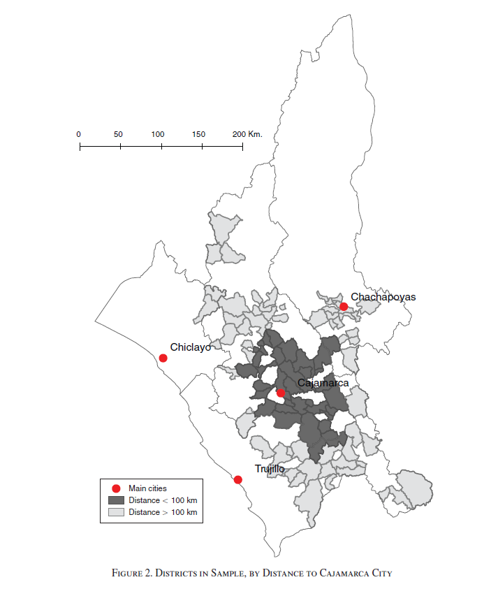

```{r setup, include=FALSE}
knitr::opts_chunk$set(echo = TRUE)
```


# **[30 points]** Difference-in-Differences Causal Identification
********************************************************************************

This section discusses the assumption that must be satisfied for a difference-in-differences estimator to be causally identified.


## **[10 points]** The Assumption
**********************************************************************

1. What is the name of the main identification assumption for difference-in-differences? 
2. Explain the intuition of the assumption.

**Your answer:**


## **[10 points]** Event Study Figures
**********************************************************************

1. Do event study figures directly test the main causal identification assumption for difference-in-differences?
2. Why or why not?

**Your answer:**


##  **[10 points]** Lagged Outcome Placebos
**********************************************************************

1. Do lagged outcome placebos directly test the main causal identification assumption for difference-in-differences?
2. Why or why not?

**Your answer:**


#  **[70 points]** Aragón and Rud (2013)
********************************************************************************

[Aragón and Rud (2013)](https://www.jstor.org/stable/43189326#metadata_info_tab_contents) are interested on the effects of mining activity on economic activity.
Their setting is the Yanacocha gold mine near Cajamarca in Peru.
They distinguish direct effects on those working in the mines, those that are local but not working in the mines, and those that are not local.
They perform a variety of specifications to identify mining activity, and they also perform many checks for alternative mechanisms.


Their empirical strategy is difference-in-differences, however, they use a version that is slightly modified from what we have discussed so far.
Specifically, they use an estimator where the variable `post` is not an indicator for being past a time period but is instead the level of mining activity (one observation per year).
Their `treat` variable is based upon household district proximity to the mine, which is close to Cajamarca.





##  **[10 points]**  Setup
**********************************************************************

Load in the packages

- `haven`
- `stringr`
- `tidyverse`
- `fixest`

and load in the data as `df`.


```{r preliminaries}

```


##  **[15 points]**  Main Results - Table 2
**********************************************************************

The author's estimate the following difference-in-differences regression:

$$y_{h,d,t} = \alpha_d + \alpha_t + \delta \left( ln(M) \times distance \right)_{d,t} + \textbf{X}_{h,d,t} \gamma + \epsilon_{h,d,t}$$
for household $h$ in district $d$ in year $t$, where $M_t$ is the level of mining activity, $distance_d$ is district distance from Cajamarca City. 
*Note: the non-interacted variable* $M_t$ *is contained within* $\alpha_t$ *and* $distance_d$ *is within* $\alpha_d$.

For the sake of brevity, we are only going to replicate only two columns of their many first-order results.


1.  **[5 points]** Create an object named `fit_tab2` using `feols()`
    - with the outcome variables `ln_y` and `ln_yrel`
    - on the interaction of interest `ln_ya_w_g2*d2`
    - with controls for `urban`, `schooling`, `age`, `electricity`, `water`, `isfemale`, `percepho`, `mieperho`
    - with fixed effects for `ubigeo`, `year`, `ciuu_cod1`, `p507`
    - using `df`
    - with `clusters` set to `ubigeo`
    - with `weights` set to `factor` (household weights)
    - on the `subset` where `ocu500 == 1` and `codperso == 1`
    
```{r fit_tab2}

```


2.  **[5 points]** create an object `tab_dict1` that is a concatenation (`c()`) of the following named objects (`variable = "Name for Variable"`)
    - `ln_y`: "Nominal Income"
    - `ln_yrel`: "Real Income"
    - `ln_ya_w_g2`: "Local Input Demand"
    - `d2`: "Distance < 100 km"
    - `ubigeo`: "District"
    - `year`: "Year"
    - `ciuu_cod1`: "Industry"
    - `p507`: "Job Type"
    
```{r tab_dict1}

```


3.  **[5 points]** Produce an `etable()` 
    - on `fit_tab2`
    - with standard errors set below,
    - `dict` set to `tab_dict1`
    - `keep` set to `"Local Input Demand x Distance < 100 km"`
    - and only show the number of observations and $R^2$


*You will get a warning about dropping an observation due to an NA.*

```{r table 2}

```


##  **[30 points]** Distance "Event" Study - Figure 4
**********************************************************************

The authors use a distance based event study figure to show that the effects of the Yanacocha gold mine on real incomes are localized.

1.  **[10 points]** Create an object
    a. `fit_fig4` that is identical to the second regression of the previous section except replace `d2` with `factor(proxr)`
    b. Print an `etable()` with `keep` set to `"x fa"`

```{r figure reg}

```


2.  **[15 points]** The next step is to create the data frame for plotting
    a. create an object `df_event` using `bind_cols()` on both
        - `coef()` on `fit_fig4`
        - `confint()` on `fit_fig4` with the argument `level` set to 0.9 and `cluster` set to `~ ubigeo`
    b. Overwrite `df_event` with `df_event` such that 
        - it is `filter()`ed using `str_detect()` with the first argument set to the `row.names()` of `df_event` and the second argument set to `":"`
        - `mutate()` a variable named `dist` that is set to `factor(c("200 km", "150 km", "100 km", "50 km", "City"))`
        - within the same `mutate()` overwrite dist using `fct_reorder()` with the first argument set to `dist` and the second set to the `rev()`ersed `levels()` of `dist`
    c. print `df_event`


```{r coef selection}

```


3.  **[5 points]** Create the distance event study figure 
    - using `ggplot()` with the `aes()` argument `x` set to `dist`, `y` to the coefficient, and `ymin` and `ymax` set to the lower and upper bound of the confidence interval repsectively
    - add a scatter plot
    - with error bars
    - and a dashed horizontal dashed line at $y=0$
    - then set the axis labels and titles to match the figure in `labs()` with the argument `caption` set to `"90% confidence intervals"`


```{r event figure}

```


##  **[15 points]** Robustness Checks - Table 7
**********************************************************************

A violation story to the authors' theorized effect of the mining activities causing changes to the local economy could be individuals migrating in.
To check for this, they explore population composition changes.

The regression considers all of those that are in the labor force. 
Because the variable that indicates labor force status `ocu500` has many `NA`s, we need adjust the variable so logic statements select the `NA`'s

1.  **[5 points]** Overwrite `df` with `df` using `mutate()` by re-coding the `NA`s in `ocu500` to be -9 using `is.na()` in `ifelse()`

```{r ocu500 na}

```

2.  **[5 points]** create `tab_dict2` that is a concatenation of `tab_dict1` with the named objects
    - `schooling`: "Years of Education",
    - `prim_full`: "Complete Primary",
    - `prime`: "Male in Prime Age"

```{r tab_dict2}

```


3.  **[5 points]** Lastly,
    a. `feols()`
        - with the three outcomes `schooling`, `prim_full`, and `prime`
        - on `ln_ya_w_g2*d2`
        - with fixed effects `ubigeo` and `year`
        - using `df`
        - with `weights` set to `~ factor`
        - and the `subset` set to `ocu500 != 4`
    b. chain these regressions using `%>%` into `etable()` that has the same specifications as the main results, except for replace `tab_dict1` with `tab_dict2`
    


```{r migration}

```


