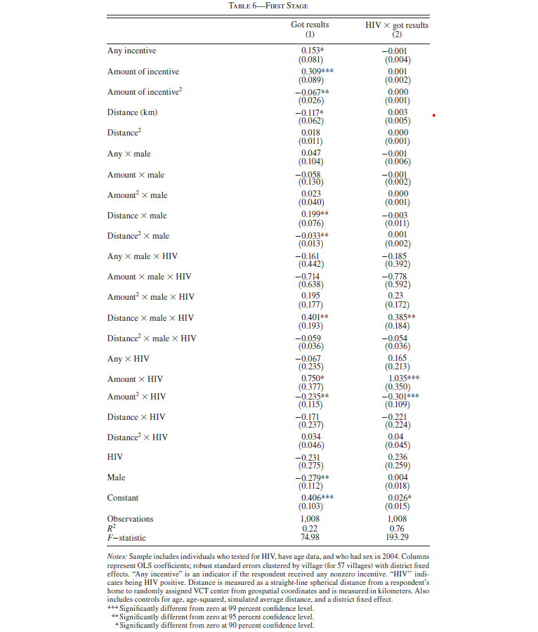
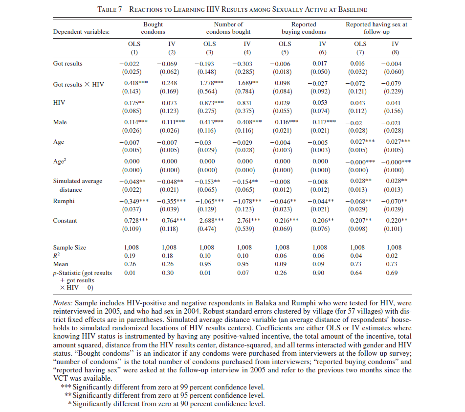

```{r setup, include=FALSE}
knitr::opts_chunk$set(echo = TRUE)
```

This script concludes our replication of Thorton (2008).
We are replicating the second half of the paper, where she looks at the effect of learning one's HIV status on risky behaviors.
Because learning the result of one's HIV test is a choice, it is an endogenous varialbe.
Consequently, identification is estimated through two-stage least squares.


# Preliminaries
********************************************************************************

Before we begin, we are going to

- load in a few packages
- load in the data
- trim to only include respondents in the followup survey.

```{r packages and data}

```


# Replication 
********************************************************************************

We are only going to replicate table 6 and column 4 of table 7.
Both tables only consider the subset in the followup survey such that they had sex in the past 12 months.
We are able to match the coefficients perfectly, however, some surprising results arise.

## Table 6 - First Stage
**********************************************************************

For comparison, here is table 6 from the paper:



We are going to jump right in and create objects `fit6_1` and `fit6_2` that correspond to the OLS regressions that are the first stages and directly plug them into `etable()`.

Note the outcome variable of column 2 is the product of the variable `got` and `hiv2004`. 
In `R` you **cannot** specify `got:hiv2004` on the left hand side of a `formula` object, so we need to create a variable that is said product.
Fortunately, this already in our data set and is named `got_hiv`.

```{r tab 6}

```
Well, I don't know about you but 0.62 seems pretty far from 75 and 6.75 seems pretty far from 193.
Maybe this has to do with the fact the these F-statistics are properly adjusted for clusters.
To get the F-statistic from an `fixest` regression, we need to use the function `fitstat()` with the first argument set equal to the regression results and the second argument equal to the statistic type we want like so:

```{r tab 6 f}

```

What happens to the F-statistic if we remove the clusters?

```{r tab 6 f no cluster}

```
Yikes! 
Well that's no better. 
Is this just some miscalculation from the `fixest` package?
Let's run this in a basic `lm()` to double check.


```{r tab6 lm}

```

Nope.
Well that is certainly a problem...

And guess what! When you go through the Stata replication files the estimated equation uses different variables than what is reported in the paper. 
And when you fix the equation to match the paper you also get F-statistics that are less than 10.
So where did the reported F-statistics come from?

## Table 7 - 2SLS Results
**********************************************************************




column 4 of table 7 has the **only** significant 2SLS result, so we are going to focus on it.

The moment we have all been waiting for: our first two-stage least squares estimation!
All we need to do is use the `feols()` function with a modified formula like so:

`feols(outcome ~ exogenous variables | endogenous variables ~ instrumental variables)`

which looks like this in our setting:

```{r tab 7 col 4}

```
Note that the `F-test (1st stage)` results are the test statistics from a Cragg-Donald weak instrument test (rejecting weak instruments) and a specifically not from the first-stage regression.


## Alternative Table 7 Specification
**********************************************************************

The specification really does have an excessive number of instruments.
Can we get by with a just-identified model?
Let's try only using the randomly assigned variables

- `any`: received any incentive
- `distvct`: distance to voluntary counselling and testing center where results were learned

```{r tab 6 col 4 just identified}

```
Well, now the significance on the Cragg-Donald test for `got_hiv` has significantly diminished.
What's going on there?
What happens if slightly over-identify by adding the randomized incentive amount `tinc` as an instrument?


```{r tab 6 col 4 over identified 1}

```

Hmmm... maybe I know what is going on.
Let's try adding one more instrument: `any:hiv2004`.


```{r tab 6 col 4 over identified 2}

```

Well that makes the test statistic look much better.

But do you see the problem here?
The endogenous variable `got_hiv` is a function of getting the results **MULTIPLIED BY** being HIV positive and the final instrument we just added is a function of having any incentive **MULTIPLIED BY** being HIV positive.
Being HIV positive appears on both sides of the first stage equation!
We are more or less predicting being HIV positive with being HIV positive.
In other words, we are predicting part of our endogenous variable with itself: an econometric no-no because it violates the exclusion restriction.

# Conclusion
********************************************************************************

1. Make sure your results can be transparently replicated. 

More generally, two-stage least squares is a useful tool for addressing endogenous variables.
Albeit, it comes at the cost of needing to satisfy a few untestable conditions.
The fundamental condition is being "as good as randomly assigned", which is typically no too difficult to defend.
Where many can get into trouble is with the exclusion restriction.
One needs a tight narrative describing how it is satisfied and to show that alternative narratives that violate the restriction are not found in the data.

Coming up next time in the IV module: estimating labor supply elasticities.
